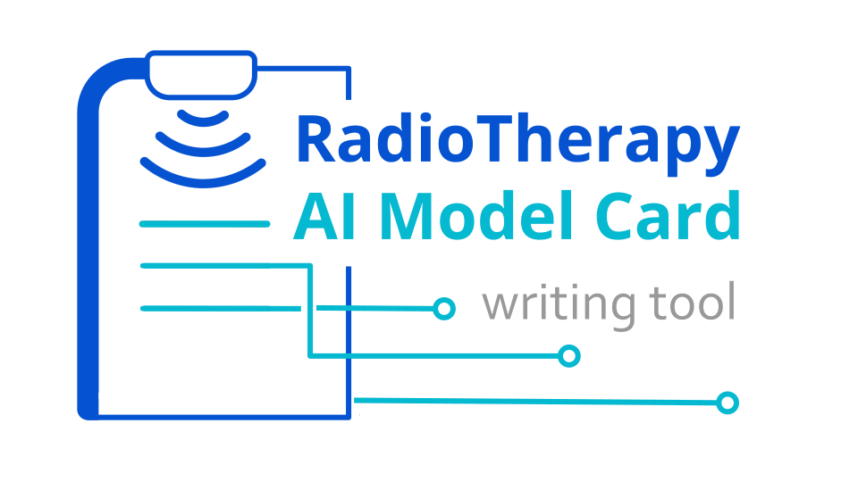

# RadioTherapy AI Model Card Writing Tool

  

**RadioTherapy AI Model Card Writing Tool** is an open, community-driven tool to enhance transparency and standardize the reporting of artificial intelligence (AI) applications in Radiation Therapy.  

It is designed for use by professionals in both research and clinical settings, supporting reproducibility, accountability, and clear communication.  

While the model card structure includes items relevant to current regulatory expectations, it is **not a substitute for compliance** with frameworks such as the EU Medical Device Regulation (MDR) or equivalent standards.  

This project is open-source and welcomes contributions from the community to evolve the tool in line with emerging best practices in RadioTherapy AI.

## Table of Contents

1. [Features](#features)
2. [Contributing](#contributing)
3. [Requirements](#requirements)
4. [Documentation](#documentation)
5. [Code of Conduct](#code-of-conduct)
6. [Security](#security)
7. [License](#license)

---

## Features
 
- **Standardized Structure**: Model cards follow a consistent 6-section format, making them easy to compare and interpret.  
- **Full Pipeline Transparency**: Provides details on the entire workflow, including pre-processing, learning architecture, and post-processing steps.  
- **Task-Specific Adaptability**: When creating a new model card, users select from four tasks (Segmentation, Dose prediction, Image-to-image translation, or Other). Based on the chosen task, the card dynamically displays the relevant task-specific fields to be filled in.   
- **Versioning Support**: Built-in fields allow tracking of updates to both the model and its documentation.  
- **Evaluation & Commissioning**: Supports multiple evaluation forms for different datasets or clinical institutions.
- **Supporting Materials Integration**: Attach or reference figures, tables, and appendices without cluttering the main document.    
- **Flexible Export Options**: Download model cards in multiple formats (.json, .pdf, .md, .zip) for sharing and archival purposes.  
- **Progress Tracking**: Built-in warning system highlights required fields that are missing or incomplete.  
- **Community-Driven Development**: Encourages feedback, edits, and contributions from the Radiation Therapy and AI community.  
- **Regulatory Awareness**: Aligned with regulatory principles (e.g., EU MDR), while clarifying it does not replace official requirements.  

## Contributing

We welcome contributions from the community to help us maintain and expand the RadioTherapy AI Model Card Writing Tool. Whether you're a clinician, researcher, industry professional, or AI enthusiast, your contributions can make a significant impact.

To get started, please review our [Contributing Guide](CONTRIBUTING.md) for guidelines and best practices.

## Documentation

- **[Contributing Guide](CONTRIBUTING.md)** - How to contribute to the project
- **[Security](SECURITY.md)** - Security policies and reporting

## Code of Conduct

We are committed to fostering a welcoming and inclusive environment for all contributors. Please review our [Code of Conduct](CODE_OF_CONDUCT.md) to ensure a positive and respectful community.

## Security

We take the security of our platform seriously. Please review our [Security Guidelines](SECURITY.md) for information on reporting vulnerabilities and security best practices.

## License

This project is licensed under the [Apache 2.0 License](LICENSE).

---

Developed and maintained by [Silvia María Herranz Hernández](https://github.com/silviaherranz)
